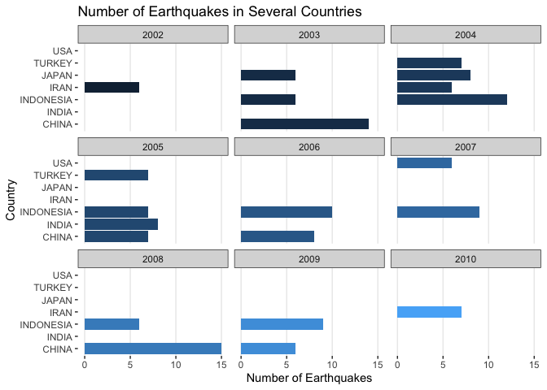
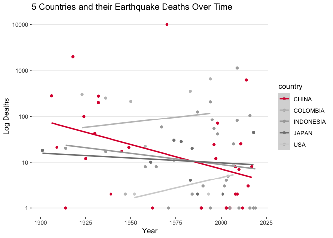
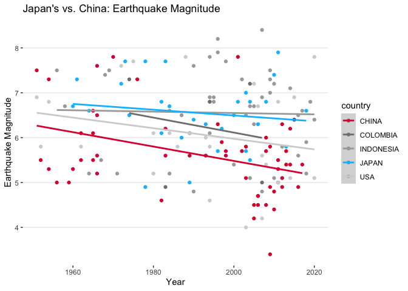

### Introduction

This investigation was done using the `Significant Earthquakes` data from the NOAA. This dataset includes a variety of features, some of which will be shown here. The data were imported, aggregated, and analyzed using three different visualizations. These visualizations involve aggregations like *group by*, *summarise*, and *filter*.


### Importing and Aggregating/Wrangling

In this section, the data is imported and aggregated. The main process was viewing and understanding the data, creating a new dataframe showing the counts of earthquakes for each country by year. The data is then sorted by counts in descending order. 


```r
library(tidyverse)
earthquakes <- read_csv("../data/earthquakes_world.csv")
```


```r
#taking a look at the data
head(earthquakes)
```

```
## # A tibble: 6 x 47
##      id flag_tsunami  year month   day  hour minute second focal_depth
##   <dbl> <chr>        <dbl> <dbl> <dbl> <dbl>  <dbl>  <dbl>       <dbl>
## 1 10509 Tsu           2020     7    22     6     12     44          28
## 2 10491 <NA>          2020     5     7    20     18     22          10
## 3 10503 <NA>          2020     6     7     5     27     22          57
## 4 10511 <NA>          2020     7    27     5     14     51          10
## 5 10502 <NA>          2020     6     4     8     49     39         107
## 6 10488 <NA>          2020     4     1    12     23     27          10
## # … with 38 more variables: eq_primary <dbl>, eq_mag_mw <dbl>, eq_mag_ms <dbl>,
## #   eq_mag_mb <dbl>, eq_mag_ml <dbl>, eq_mag_mfa <lgl>, eq_mag_unk <dbl>,
## #   intensity <dbl>, country <chr>, state <chr>, location_name <chr>,
## #   latitude <dbl>, longitude <dbl>, region_code <dbl>, deaths <dbl>,
## #   deaths_description <dbl>, missing <dbl>, missing_description <dbl>,
## #   injuries <dbl>, injuries_description <dbl>, damage_millions_dollars <dbl>,
## #   damage_description <dbl>, houses_destroyed <dbl>,
## #   houses_destroyed_description <dbl>, houses_damaged <dbl>,
## #   houses_damaged_description <dbl>, total_deaths <dbl>,
## #   total_deaths_description <dbl>, total_missing <dbl>,
## #   total_missing_description <dbl>, total_injuries <dbl>,
## #   total_injuries_description <dbl>, total_damage_millions_dollars <dbl>,
## #   total_damage_description <dbl>, total_houses_destroyed <dbl>,
## #   total_houses_destroyed_description <dbl>, total_houses_damaged <dbl>,
## #   total_houses_damaged_description <dbl>
```


```r
#what are some of the countries with the highest amounts of earthquakes per year 
n_per_yr <- earthquakes %>% 
      filter(year > 0) %>%
      count(year, country) %>% 
      data.frame()
     
n_per_yr %>% arrange(desc(n)) %>%  head(10)
```

```
##    year   country  n
## 1  2008     CHINA 15
## 2  2003     CHINA 14
## 3  1966     CHINA 12
## 4  2004 INDONESIA 12
## 5  1938     JAPAN 11
## 6  2018 INDONESIA 11
## 7  2006 INDONESIA 10
## 8  2011     CHINA 10
## 9  2007 INDONESIA  9
## 10 2009 INDONESIA  9
```

From the output above, it can be shown that Japan, Indonesia, and China have the highest amounts of earthquakes. Since the data is grouped by years, this means that the values shown are aggregated during the respective years shown in the `year` column. Let us visualize this in a more understandable manner. 

### Visualization and Analysis


```r
# Faceted bar chart. I could not really understand how to have each year have the most in that year. 
# SO this is how it will be for now

n_per_yr %>% 
  filter(year > 2000 & year < 2011) %>%
  top_n(20) %>% 
      ggplot(aes(x = country, y = n, fill = year)) +
      geom_col() +
      facet_wrap(~ year) +
      coord_flip() +
      theme_bw() +
      theme(panel.border = element_blank(), panel.grid.major.y = element_blank(), 
            panel.grid.minor = element_blank(), legend.position = "none") +
          labs(title = "Number of Earthquakes in Several Countries", 
               y = "Number of Earthquakes", x = "Country")
```

<!-- -->

It holds true that the countries listed above have the highest counts of earthquakes in the years from 2000 to 2010. There is a surprising result in that in the entire decade of the 2000s, the US only had 6 earthquakes *total*. All of these earthquakes were also only concentrated in one year. 


What about the deaths caused by these earthquakes? Starting from 1900, a scatterplot of all of the datapoints of the four countries listed above are shown. One particular point of focus is the trends represented by the linear models. 


```r
# Plot over time of the earthquakes for four different countries

#Selecting countries of interest
country_v <- c("USA", "JAPAN", "CHINA", "COLOMBIA", "INDONESIA")

#Plot showing five countries
earthquakes %>% 
  filter(country == country_v & year > 1900) %>% 
    ggplot(aes(x = year, y = deaths)) +
    geom_point(aes(color = country)) +
    geom_smooth(method = "lm", aes(color = country), level = FALSE) +
    scale_y_log10() +
    scale_color_manual(values = c("CHINA" = "#DC143C", "USA" = "#D3D3D3", 
                                  "JAPAN" = "#808080", "COLOMBIA" = "#C0C0C0", "INDONESIA" = "#A9A9A9")) +
    theme_bw() +
    theme(panel.border = element_blank(), panel.grid.major.x = element_blank(), 
          panel.grid.minor = element_blank()) +
    labs(title = "5 Countries and their Earthquake Deaths Over Time", x = "Year", y = "Log Deaths")
```

```
## `geom_smooth()` using formula 'y ~ x'
```

<!-- -->

From the graph above, one can see that China has the greatest change in log deaths over time. This is perhaps skewed by the huge death toll from the earthquake in Vietnam (which is wrongly assumed to be part of China) in 1970. China has largely decreasing deaths from earthquakes over the last century. 

How does this change when comparing earthquake magnitude over time? This visualization also emphasizes Japanese earthquakes, a close relative to china geographically (as well as known for its earthquakes and resulting tsunamis.) **NOTE** Ideally, this graph would have just two lines, showing Japan and China using linear models. This could not be made to work in time. 


```r
# Is there a trend in magnitude over time for the last 70 years

earthquakes %>% 
  filter(year > 1950 & country == country_v) %>% 
  ggplot(aes(x = year, y = eq_primary)) +
  geom_point(aes(color = country)) + #C0C0C0 #DC143C
  geom_smooth(method = "lm", aes(color = country), level = FALSE)+
    scale_color_manual(values = c("CHINA" = "#DC143C", "USA" = "#D3D3D3", 
                                  "JAPAN" = "#00BFFF", "COLOMBIA" = "#808080", "INDONESIA" = "#A9A9A9")) +
  theme_bw() +
    theme(panel.border = element_blank(), panel.grid.major.x = element_blank(), 
          panel.grid.minor = element_blank()) +
    labs(title = "Japan's vs. China: Earthquake Magnitude", x = "Year", y = "Earthquake Magnitude")
```

```
## `geom_smooth()` using formula 'y ~ x'
```

```
## Warning: Removed 5 rows containing non-finite values (stat_smooth).
```

```
## Warning: Removed 5 rows containing missing values (geom_point).
```

<!-- -->

### Discussion

It seems that of all of the countries, Indonesia, China, and Japan have the highest number of earthquakes. These earthquakes are often high in magnitude, especially in Japan, which has some of the highest and most destructive earthquakes and tsunamis. Japan seems to have a slight downward trend in earthquake magnitude over time, where as a much higher downward trend can be seen in China and the USA. Future explorations of this data will hopefully explore mapping these data to a global map, to then see the data over time geographically. 

The principles of data visualization were applied in this project in various ways. In numerous graphs, the colours are contrasted, specific variables pop in colour over gray-shaded ones, and axes were adjusted to make the graphics flow and very well. Despite the lack of detailed information or statistical learning, I would say the graphics here represent core design philosophies and principles of data visualization championed by people like Edward Tufte. 

